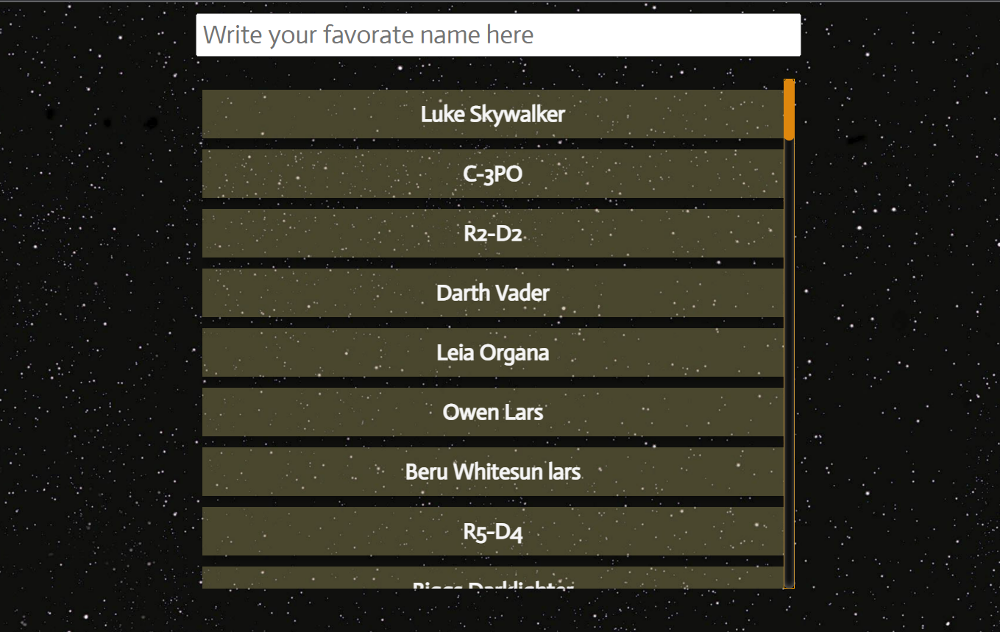
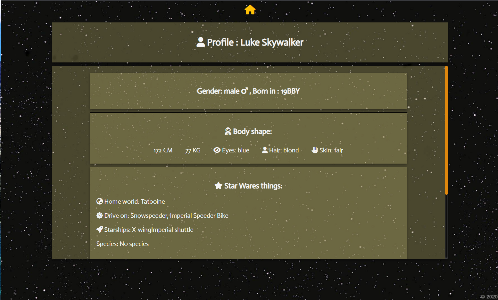

# ⭐ My solution to the "Star Wars museum" mission ⭐

#### After long attempts to figure out what's wrong with the submission site, I decided to go back to vs-code and submit a basic but working solution. I did not want to take too much time for the sake of fairness.

#### Hope you appreciate the retry 🙏

---

## Technologies in use 💻⚙

- ### **React - contextApi, frontend routers**
- ### **Typescript**

## Pages :

### BASE_URL/ - Search box with peoples list

### BASE_URL/:name - Person's data

---
